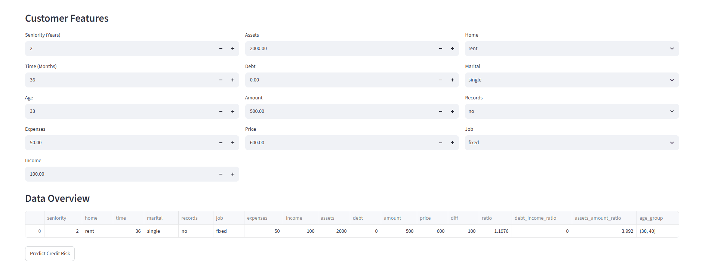
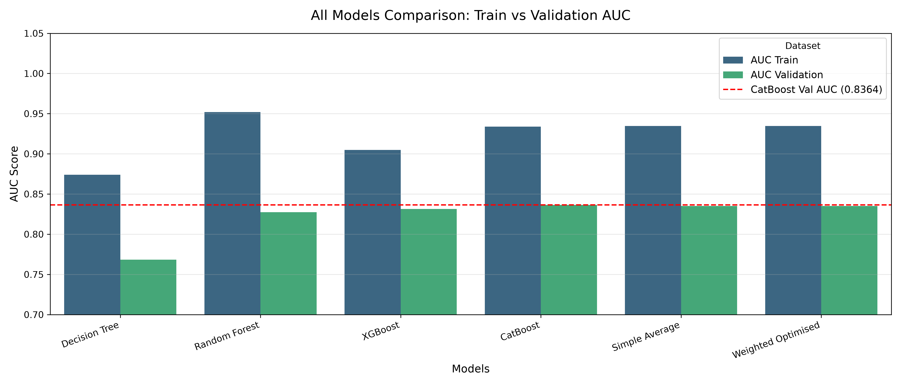
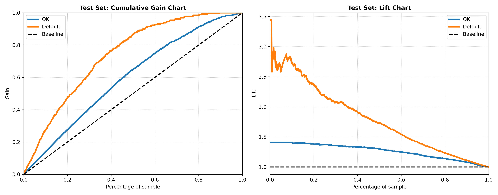
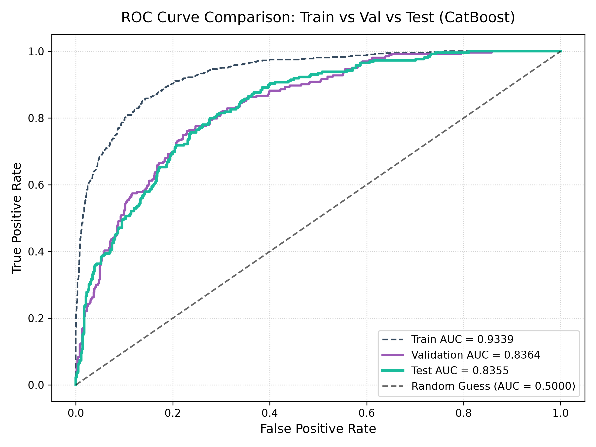
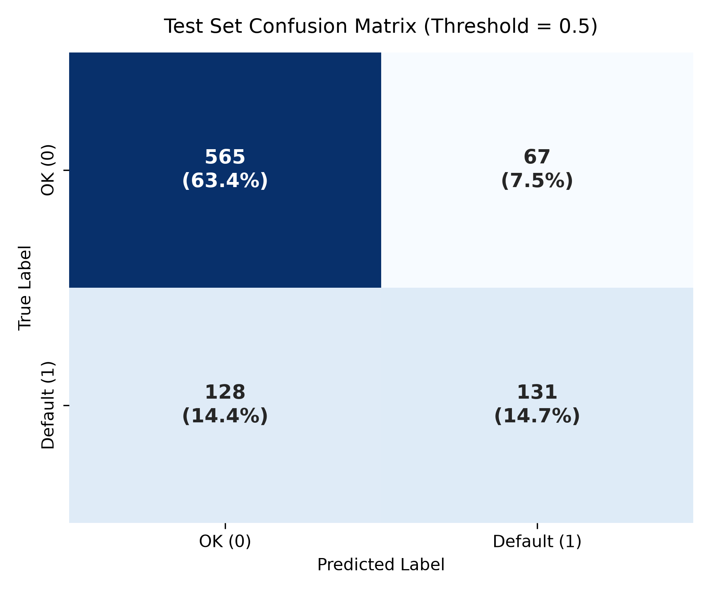
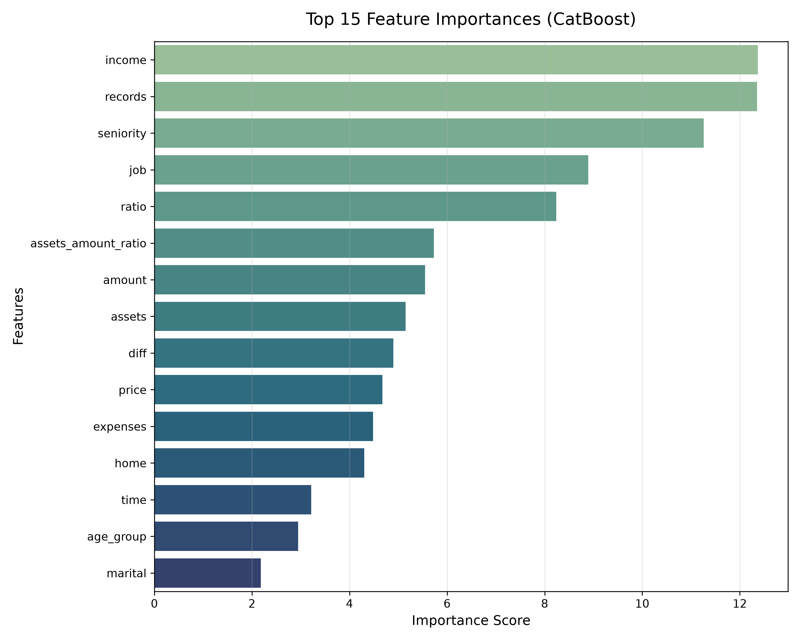

# Credit Risk Classification

## Overview
An end-to-end Machine Learning pipeline and interactive Streamlit web application designed to evaluate loan applicants' default risk. Powered by **CatBoost** and tuned via **Optuna**, this project predicts whether a customer will default (`Default`) or fulfill their repayments (`OK`), helping financial institutions make data-driven lending decisions and minimize bad debt.


> For in-depth details for Exploratory Data Analysis (EDA), Model Selection and Tuning, and Results, please refer to the [Full Technical Report](credit_risk_report.md).

---

## Demo



**Try the Live Interactive Web App:** [Credit Risk Predictor on Streamlit Cloud](https://credit-risk-predictor-3s6tc4fmw4rvarsru89jms.streamlit.app)

---

## Key Features & Highlights

* **Domain-Specific Categorical Encoding**: Standardized raw categorical signals into structured financial domain features (`rent`, `owner`, `single`, `married`, `fixed`, `freelance`, etc.) to ensure feature integrity and interpretability.

* **Advanced Feature Engineering**: Created 5 highly predictive financial ratios and domain-specific groupings:
  * `diff`: Price vs. Loan Amount difference (`price - amount`).
  * `ratio`: Purchase financing coverage ratio (`price / (amount + 1)`).
  * `debt_income_ratio`: Leverage index (`debt / (income + 1)`).
  * `assets_amount_ratio`: Asset-to-loan collateral coverage (`assets / (amount + 1)`).
  * `age_group`: Categorical binning of customer age into 10-year intervals (10–80).

* **Hyperparameter Optimization with Optuna**: Systematic multi-model comparison across Decision Trees, Random Forest, XGBoost, and CatBoost.


* **Simple Average and Weighted Optimised Ensemble**: Built and evaluated ensemble strategies—combining top-performing gradient boosted trees via simple averaging and weight-optimized blending. Aim to maximize AUC-ROC and probability calibration.

* **Streamlit Web Application**: An intuitive multi-column dashboard built for credit underwriters to enter customer specifications and receive real-time default probability scores.

---

## Key Results  

### 1. Model Comparison & Metrics

A comparison was conducted across single models and ensemble architectures. **CatBoost** emerged as the top individual model with a Validation AUC of **`0.8362`**, closely followed by the **Ensemble models** (`0.8345`).

<p align="center">
  
</p>

* **Top Performer**: CatBoost (`AUC = 0.8346`) balanced optimal feature learning with minimal overfitting compared to Random Forest.
* **Ensembles**: Simple Average and Weighted Ensembles both achieved `0.8352` AUC.

### 2. Evaluate CatBoost on Test Set

The CatBoost model demonstrates robust generalization on the unseen test set, effective risk separation, and a low false-positive rate.

<p align="center">
  
</p>

* **Business Value (Gain/Lift)**: Targeting the top **20% highest-risk applicants** captures roughly **50% of total default cases**, operating at **2.5x to 3.0x+ Lift** in the upper deciles.

<p align="center">
    
  
</p>

* **ROC & Generalization**: The hold-out Test AUC (`0.8342`) matches the Validation AUC (`0.8346`) closely, confirming zero data leakage or overfitting.

* **Classification Performance**: At the default threshold (`0.5`), the model achieves an overall test accuracy of **78.1%**, maintaining high precision with only **67 false positives (7.5%)** to minimize unjust rejections of qualified applicants.

### 3. Key Feature Importance

The top factors driving default risk in the CatBoost model highlight the crucial impact of credit history and financial capacity.

<p align="center">
  
</p>

* **Primary Drivers**: `income`, `seniority`, `records`, and `job` type are the most influential predictors.
* **Engineered Ratios**: Custom features like `ratio` (`price/amount`), `diff`(`price - amount`) and `assets_amount_ratio` provided significant predictive power over raw attributes.


---

## Tech Stack

* **Language:** Python `3.12.11`
* **Data Processing & Analysis:** Pandas, NumPy
* **Machine Learning:** Scikit-Learn, XGBoost, CatBoost
* **Visualization:** Matplotlib, Seaborn
* **Tuning and optimization:** Optuna, Scipy
* **Model Persistence:** Joblib
* **Web Framework:** Streamlit

---

## Project Structure

```text
credit-risk-predictor/
├── assets/
│   └── Demo.gif                        # Demonstration GIF for README
├── data/                               # Data set
├── credit_risk_classification.ipynb    # Complete Machine Learning pipeline
├── credit_risk_report.md               # Comprehensive technical report
├── app.py                              # Interactive Streamlit web application
├── requirements.txt                    # Python dependencies
└── README.md                           # Project documentation
```

The execution pipeline automatically generates and manages the following runtime directories:

```text
├── models/               # Stores trained model files
├── plots/                # Generated visualizations
│    ├── EDA/             # Exploratory Data Analysis plots
│    ├── Tuning/          # Hyperparameter tuning visualizations
│    ├── Evaluation/      # Evaluation Metrics visualizations
│    └── Features/        # Feature importance visualizations
└── catboost_info         # Information of the CatBoost Model
```

---

## How to Run

First clone the repository:
```bash
git clone https://github.com/BevisWong76/credit-risk-predictor.git
cd credit-risk-predictor
```

You can then set up the project locally using either the standard Python `venv` or the ultra-fast `uv` package manager.

### Option 1: Using Standard Python `venv` (Traditional)

1. Create a virtual environment:
```bash
python -m venv .venv
```

2. Activate the virtual environment:
```bash
# Windows (Command Prompt):
.venv\Scripts\activate.bat

# Windows (PowerShell):
.venv\Scripts\Activate.ps1

# macOS / Linux:
source .venv/bin/activate
```

3. Install dependencies:
```bash
pip install --upgrade pip
pip install -r requirements.txt
```

### Option 2: Using `uv` (Recommended for Speed)

`uv` is an extremely fast Python package installer and resolver written in Rust.

1. Install `uv` (if you haven't already):
```bash
pip install uv
```

2.  Create a virtual environment:

```bash
uv venv
```

3. Activate the virtual environment:
```bash
# Windows (Command Prompt):
.venv\Scripts\activate.bat

# Windows (PowerShell):
.venv\Scripts\Activate.ps1

# macOS / Linux:
source .venv/bin/activate
```

 4. Install dependencies:
```bash
uv pip install --upgrade pip
uv pip install -r requirements.txt
```

### Run the Streamlit App

Once the dependencies are installed and the model artifacts are generated, launch the interactive web application:

```bash
streamlit run app.py
```
---

## Acknowledgements

* **Dataset:** Based on the Credit Scoring dataset from [gastonstat/CreditScoring](https://github.com/gastonstat/CreditScoring).

* **Inspiration:** Core concepts inspired by the [DataTalksClub Machine Learning Zoomcamp](https://github.com/DataTalksClub/machine-learning-zoomcamp).


### Key Enhancements Beyond Baseline

* **Robust Feature Pipeline:** Added 5 custom financial ratios (`ratio`, `assets_amount_ratio`, etc.) and binning rules integrated directly into the pipeline.
* **Advanced Tuning & Ensembling:** Tuned 4 distinct algorithms via **Optuna** and implemented **Simple Average** & **Weighted Optimised Ensembles**.
* **Business Evaluation:** Added **Gain & Lift charts** and Feature Importance analysis to measure real credit underwriting value.
* **Interactive Web App:** Built a full Streamlit dashboard for real-time risk assessment and probability scoring.