# Full Report of the Credit Risk Classification Project

## Table of Contents
1. [Problem Definition](#1-problem-definition)
2. [Data Preprocessing and Exploratory Data Analysis](#2-data-preprocessing-and-exploratory-data-analysis)
3. [Modelling and Hyperparameter Tuning](#3-modelling-and-hyperparameter-tuning)
4. [Final Model Evaluation and Comparison](#4-final-model-evaluation-and-comparison)
5. [Feature Importance Analysis and Model Interpretability](#5-feature-importance-analysis-and-model-interpretability)
6. [Conclusion](#6-conclusion)
7. [Acknowledgements](#7-acknowledgements)

---
## 1. Problem Definition

### 1.1 Problem Statement
This is a machine learning project focused on credit risk assessment. The goal is to predict whether a loan applicant will default on their payments (`Default`) or successfully repay (`OK`). By estimating default probabilities, the system helps automate risk evaluation and identify high-risk applicants.

### 1.2 Machine Learning Formulation
* **Learning Type:** Supervised Binary Classification.
* **Target Variable:** `Status`
  * `1` (`Default`): High-risk applicant who defaulted (Positive Class).
  * `0` (`OK`): Low-risk applicant who repaid (Negative Class).
* **Feature Set:** 14 raw features (demographics, financial status, loan terms) and 5 engineered financial features (`diff`, `ratio`, `debt_income_ratio`, `assets_amount_ratio`, and `age_group`).
* **Validation Strategy:** Train / Validation / Test Split (e.g., 60% Train, 20% Validation, 20% Test) with fixed `random_state` for reproducibility..

### 1.3 Evaluation Metrics
* **AUC-ROC:** Primary metric to measure the model's ability to distinguish default from non-default applicants across thresholds.
* **Cumulative Gain & Lift:** Used to assess how well the top-ranked risk predictions capture actual defaults.

### 1.4 Data Source
* **Dataset:** Credit Scoring dataset from [gastonstat/CreditScoring](https://github.com/gastonstat/CreditScoring).
* **Scope:** Historical retail credit applications containing financial indicators, applicant background, and repayment status.

---

## 2. Data Preprocessing and Exploratory Data Analysis

### 2.1 Data Dictionary

The dataset consists of 13 feature variables (demographic, financial, and loan characteristics) and 1 target variable (`Status`).

| Variable Name | Role | Data Type | Description & Category Mappings |
| :--- | :--- | :--- | :--- |
| **`Status`** | Target | Categorical | Primary loan outcome (e.g., paid off vs. default). |
| **`Seniority`** | Feature | Numerical | Job tenure or length of service with current employer (years). |
| **`Home`** | Feature | Categorical | Home ownership status *(e.g., 1 = Rent, 2 = Owner, 3 = Private, 4 = Parents, etc.)*. |
| **`Time`** | Feature | Numerical | Duration / term of the requested loan (months). |
| **`Age`** | Feature | Numerical | Age of the applicant (years). |
| **`Marital`** | Feature | Categorical | Marital status *(e.g., 1 = Single, 2 = Married, 3 = Separated, 4 = Widowed, etc.)*. |
| **`Records`** | Feature | Categorical | Presence of public credit records/defaults *(e.g., 1 = No, 2 = Yes)*. |
| **`Job`** | Feature | Categorical | Employment category *(e.g., 1 = Fixed, 2 = Part-time, 3 = Freelance, etc.)*. |
| **`Expenses`** | Feature | Numerical | Total living expenses or recurring expenditures per month. |
| **`Income`** | Feature | Numerical | Net income of the applicant per month. |
| **`Assets`** | Feature | Numerical | Declared monetary value of applicant-owned assets. |
| **`Debt`** | Feature | Numerical | Total outstanding debt obligations. |
| **`Amount`** | Feature | Numerical | Total requested loan amount. |
| **`Price`** | Feature | Numerical | Total price or market value of the item being financed. |

### 2.2 Feature Engineering

To capture non-linear relationships and financial risk dynamics, several domain-specific features were engineered from the baseline variables:

  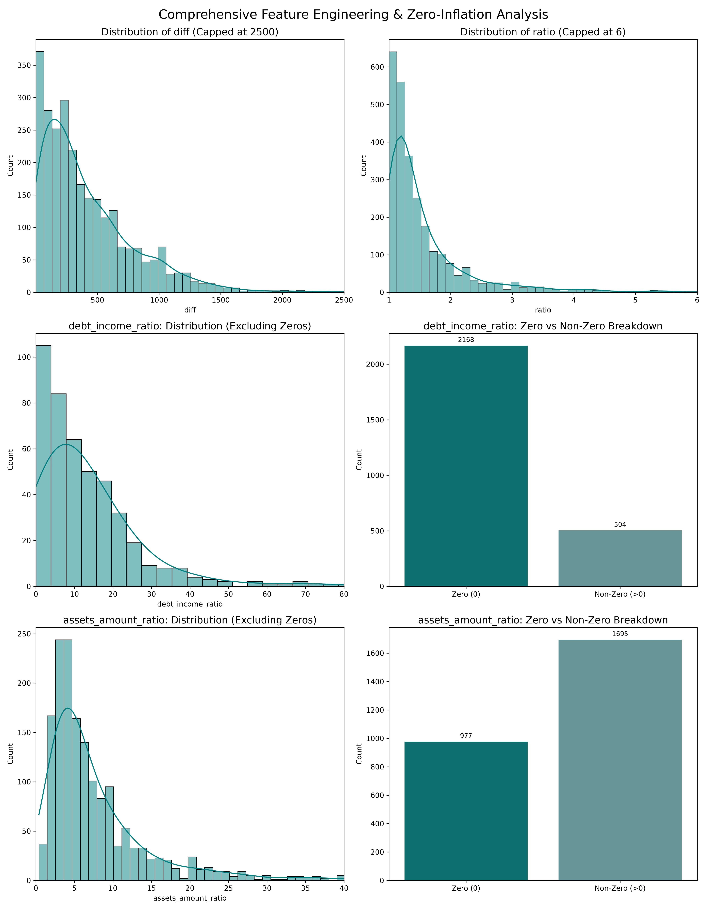

* **Age Grouping (`age_group`):** Discretized continuous `age` into 10-year bins ($0–20, \dots, 60–100$) to better capture non-linear default risks across life stages, replacing the raw `age` feature.

* **Loan & Asset Ratios (`diff`, `ratio`):** Calculated equity margin (`diff` = $\text{price} - \text{amount}$) and collateral coverage (`ratio` = $\frac{\text{price}}{\text{amount} + 1}$) to measure applicant investment and asset backing for the loan.

* **Affordability Metrics (`debt_income_ratio`, `assets_amount_ratio`):** Formulated financial leverage ($\frac{\text{debt}}{\text{income} + 1}$) and asset coverage ($\frac{\text{assets}}{\text{amount} + 1}$) to capture applicant solvency, clipping extreme outliers at their 99th percentile ($Q_{0.99}$) to prevent tree split distortion.

* **Exploratory Visualization & Zero-Inflation:** To resolve severe visualization distortion caused by heavy zero-inflation, the plots explicitly isolate non-zero continuous distributions alongside discrete zero-count breakdowns—revealing **2,168 zero-debt** records versus **504 non-zero** cases,and **977 zero-asset** records against **1,695 asset-positive** applicants.

### 2.3 Exploratory Data Analysis (EDA) Summary

#### 2.3.1 Target Variable Distribution

  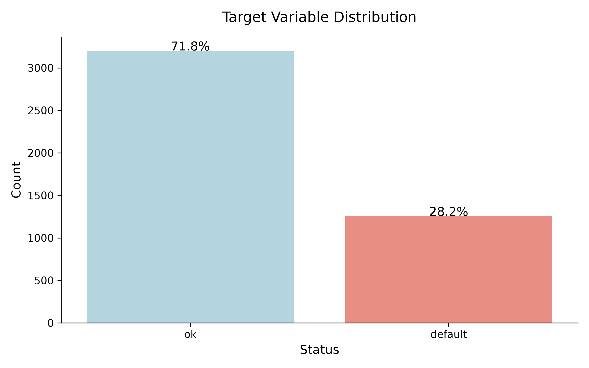

* **Target Class Imbalance:** Analysis of `Status` reveals significant class imbalance, with **71.8%** of loans performing normally (`ok`) and **28.2%** resulting in `default`. Downstream evaluation strategies must account for this baseline imbalance using threshold tuning or balanced performance metrics (e.g., ROC-AUC, F1-score).

#### 2.3.2 Default Status by Age Group

  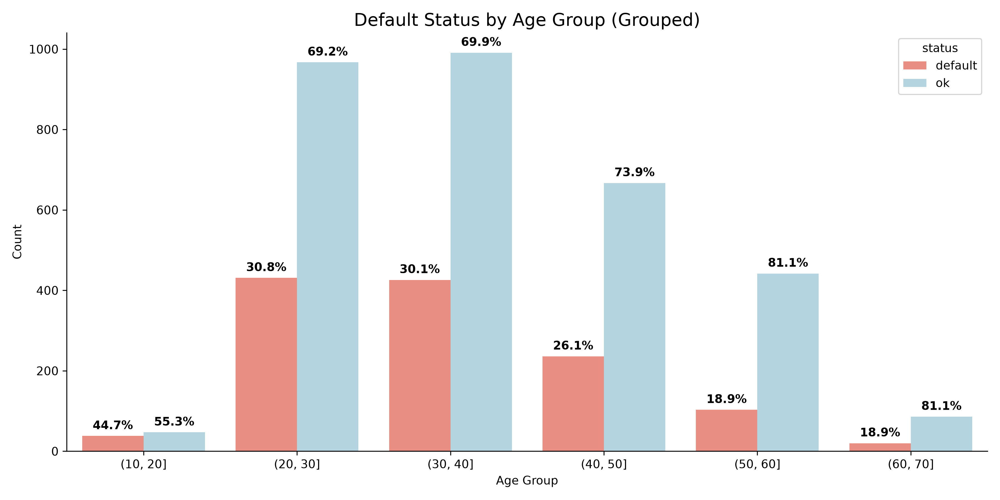

* **Age-Dependent Default Rates:** Grouped age breakdowns indicate an inverse relationship between applicant age and default probability. Younger borrowers demonstrate markedly higher default rates—peaking at **44.7%** for the `(10, 20]` bracket and **30.8%** for `(20, 30]`—whereas older age groups (`50+`) exhibit default rates under **19%**.

#### 2.3.3 Loan-to-Value & Financing Collateral Analysis

  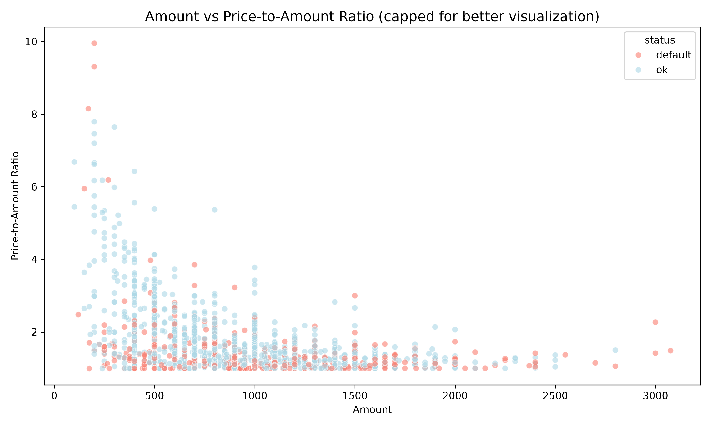

* **Loan-to-Value & Financing Collateral:** The scatter analysis comparing requested `Amount` against the `Price-to-Amount Ratio` reveals that higher price-to-loan ratios (stronger collateral security) are predominantly concentrated in lower loan amount brackets ($\le 500$). Defaults are evenly dispersed across amounts, but show elevated density in regions where collateral coverage approaches $1.0$.

#### 2.3.4 Feature Collinearity Analysis

  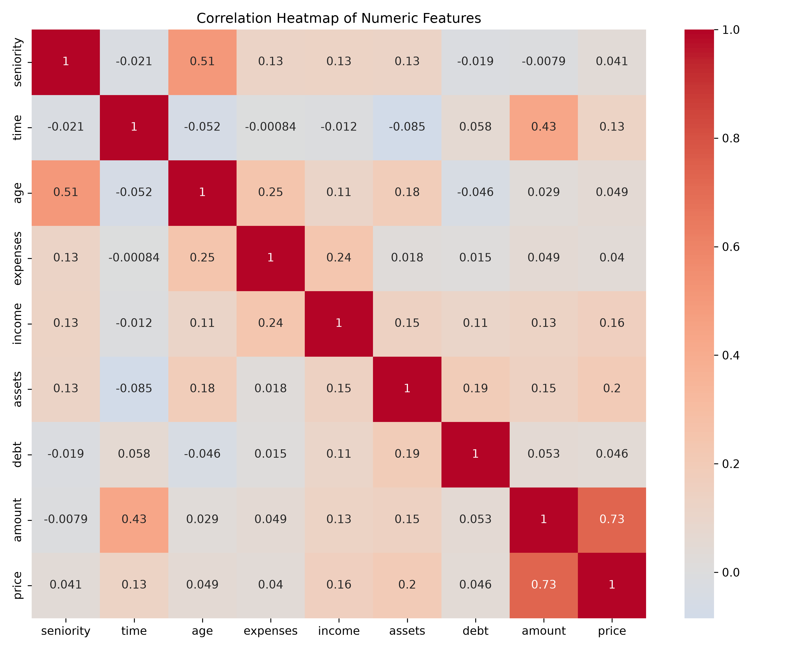

* **Feature Collinearity Analysis:** Linear correlation evaluations highlight strong positive relationships between financial scale features—most notably `amount` and `price` ($r = 0.73$), alongside `seniority` and `age` ($r = 0.51$) and `time` and `amount` ($r = 0.43$). These linear dependencies reinforce the necessity of non-linear tree-based models and feature ratios to capture distinct credit risk signals without collinear redundancy.

---

## 3. Modelling and Hyperparameter Tuning

### 3.1 Model Formulation & Baseline Benchmarking

  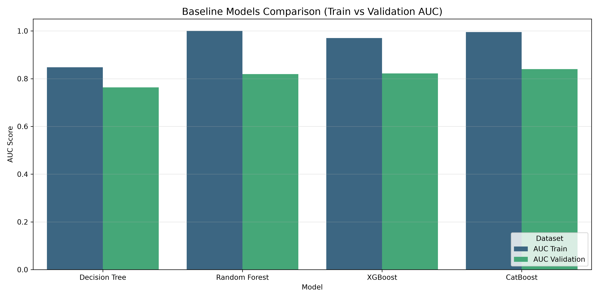

To evaluate model performance prior to hyperparameter tuning, four tree-based architectures—**Decision Tree**, **Random Forest**, **XGBoost**, and **CatBoost**—were benchmarked using Area Under the ROC Curve (AUC) on both training and validation sets:

* **Overfitting Proneness:** Ensembles with unconstrained default hyperparameters (Random Forest, XGBoost, and CatBoost) achieved near-perfect training AUC scores ($\approx 0.97 - 1.00$), indicating heavy memorization of the training distribution.

* **Validation Performance:** Despite severe training-set overfitting, ensemble methods significantly outperformed the single **Decision Tree** (validation AUC $\approx 0.76$). 

* **Top Baseline Performer:** **CatBoost** achieved the highest baseline validation performance (AUC $\approx 0.84$), closely followed by XGBoost and Random Forest (both $\approx 0.82$), establishing boosting architectures as the primary candidates for downstream hyperparameter optimization.

### 3.2 Hyperparameter Optimization

To mitigate overfitting and maximize generalization performance, hyperparameter tuning was conducted across the models using systematic search strategies.

#### 3.2.1 Decision Tree Optimization

  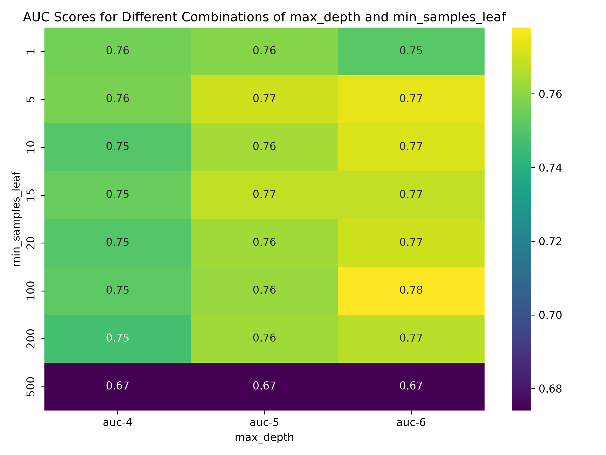

The Decision Tree was tuned using a **two-step optimization strategy**:

1. **Depth Exploration:** First, `max_depth` was evaluated across a range from $1$ to $10$ (as well as unconstrained `None`). A depth of $5$ yielded the strongest initial signal, establishing the search region for fine-tuning.
2. **Focused Grid Search:** A second-stage grid search was then conducted across `max_depth` ($\{4, 5, 6\}$) and `min_samples_leaf` values ($\{1, 5, 10, 15, 20, 100, 200, 500\}$):

* **Optimal Parameters:** The peak validation AUC of **0.78** was achieved at **`max_depth = 6`** and **`min_samples_leaf = 100`**.
* **Underfitting & Overfitting Boundaries:** Setting `min_samples_leaf = 500` severely underfit the data, dropping AUC across all depths to **0.67**. Conversely, shallow depths (`max_depth = 4`) plateaued around **0.75–0.76** regardless of leaf size constraints.

#### 3.2.2 Random Forest Optimization

  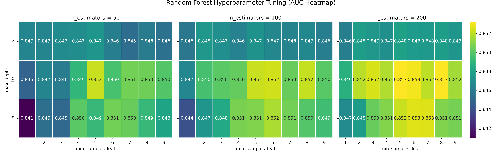

A grid search (`GridSearchCV`) was executed across `n_estimators` ($\{50, 100, 200\}$), `max_depth` ($\{5, 10, 15\}$), and `min_samples_leaf` ($\{1 \dots 9\}$):

* **Optimal Parameters:** The model achieved its highest validation AUC of **0.853** with **`n_estimators = 200`**, **`max_depth = 10`** (and `15`), and **`min_samples_leaf = 5–8`**.
* **Depth & Regularization Dynamics:** A moderate tree depth (`max_depth = 10`) combined with leaf regularization (`min_samples_leaf` $\ge 5$) effectively controlled tree complexity while preserving predictive capacity, significantly outperforming unconstrained single-sample leaves (`min_samples_leaf = 1`).

  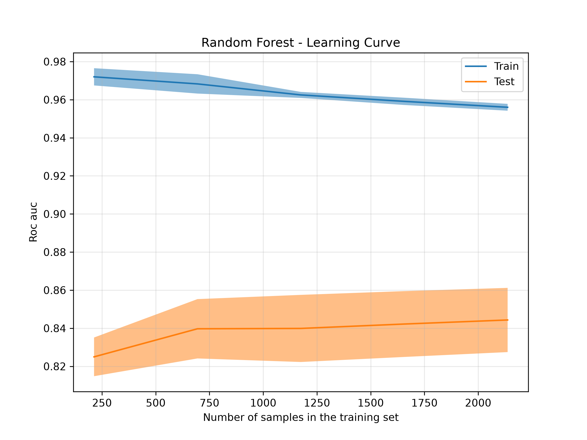

* **Learning Curve Analysis:** The learning curve for the tuned Random Forest demonstrates stable generalization as training sample size increases. While a variance gap remains between training ($\approx 0.96$ AUC) and test performance ($\approx 0.845$ AUC), test score trajectory shows steady improvement with additional data without entering an overfit divergence regime.

#### 3.2.3 XGBoost Optimization

  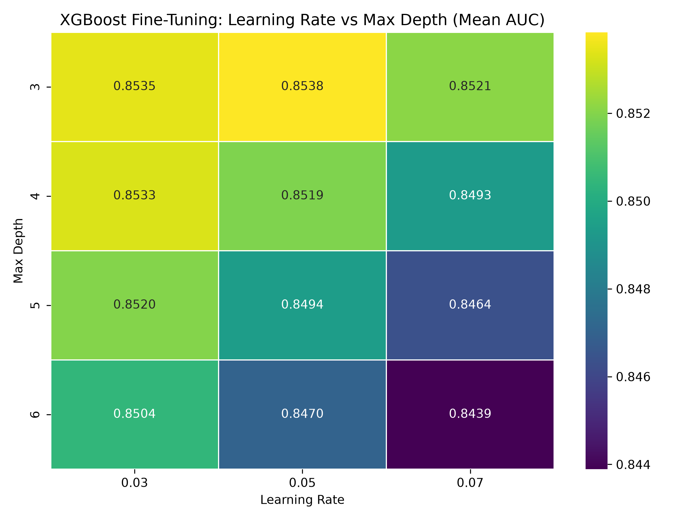

XGBoost was optimized using a two-stage strategy: an initial coarse **Randomized Search** to identify promising hyperparameter regions, followed by a focused **Grid Search** fine-tuning:

* **Optimal Parameters:** The grid search converged at **`max_depth = 3`** and **`learning_rate = 0.05`**, yielding a peak mean validation AUC of **0.8538**.
* **Regularization Insight:** Performance decayed systematically as tree depth increased, dropping to **0.8439** at `max_depth = 6`. Constraining tree depth proved critical for preventing boosting-induced variance on this dataset.

#### 3.2.4 CatBoost Optimization via Optuna

CatBoost was tuned via Bayesian framework using **Optuna** across 20 trials, optimizing `subsample`, `colsample_bylevel`, `learning_rate`, `l2_leaf_reg`, and `depth`:

  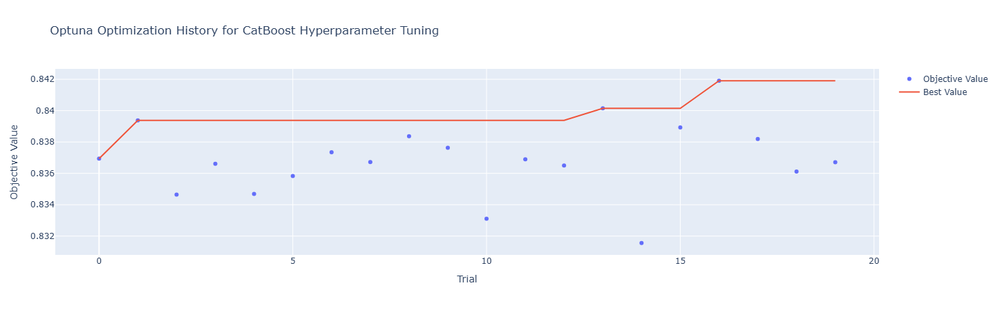

* **Optimization Progression:** The framework quickly achieved a solid baseline ($\approx 0.839$ AUC) in early trials, stepped up around Trial 13, and reached a final peak objective AUC of **0.842** by Trial 16.

  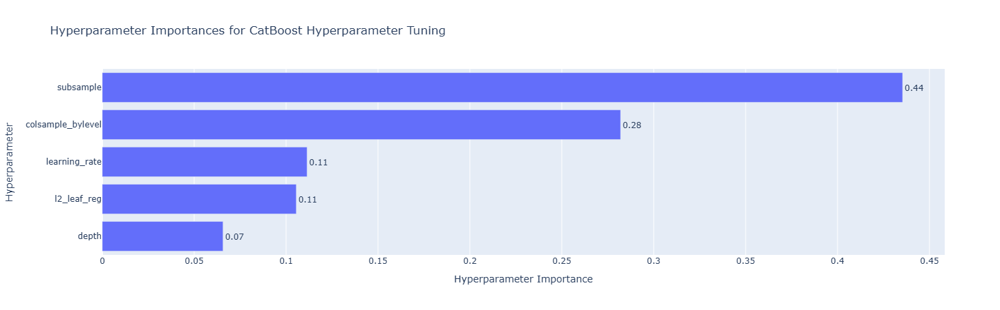

* **Hyperparameter Sensitivity Analysis:** Optuna's parameter importance evaluation revealed that **`subsample`** (**0.44**) and **`colsample_bylevel`** (**0.28**) dominated model performance, accounting for over **70%** of total parameter impact. Stochastic row and column feature sampling proved significantly more decisive than tree architecture (`depth` at **0.07**) or L2 regularization (`l2_leaf_reg` at **0.11**).

### 3.3 Hyperparameter Tuning Summary & Model Comparison

To select the candidate model for deployment, the performance of all optimized architectures and ensemble strategies was evaluated across training and validation AUC metrics.

  

| Model Architecture | Train AUC | Validation AUC | Overfitting Gap ($\Delta$) |
| :--- | :---: | :---: | :---: |
| **Decision Tree** | 0.8740 | 0.7682 | 0.1057 |
| **Random Forest** | 0.9519 | 0.8274 | 0.1245 |
| **XGBoost** | 0.9050 | 0.8315 | 0.0735 |
| **CatBoost** | 0.9339 | **0.8364** | 0.0975 |
| **Simple Average Ensemble** | **0.9345** | 0.8353 | 0.0993 |
| **Weighted Optimised Ensemble** | **0.9345** | 0.8353 | 0.0993 |

* **Ensemble Strategy & Weight Convergence:** Both a **Simple Average** and a **Weighted Optimization** blending strategy were evaluated across the top three tree ensembles (Random Forest + XGBoost + CatBoost). However, the optimization search converged to equal weights ($\frac{1}{3}, \frac{1}{3}, \frac{1}{3}$), making the performance metrics for both ensemble approaches identical.
* **Ensemble vs. Standalone Performance:** While ensembling achieved a marginally higher training score (**0.9345** vs **0.9339**), it yielded a slightly lower validation AUC (**0.8353**) compared to standalone CatBoost, indicating minor generalization degradation without meaningful performance gains.
* **Final Model Selection:** **CatBoost** emerged as the winning architecture, achieving the highest overall validation AUC (**0.8364**) with strong generalization control ($\Delta = 0.0975$), making it the primary model selected for final deployment and evaluation.

---

## 4. Final Model Evaluation and Comparison

### 4.1 Model Benchmarking & Performance Comparison

Model performance was evaluated using Receiver Operating Characteristic (ROC) curves, Cumulative Gain charts, and Lift curves on the validation set.

#### 4.1.1 ROC Curve Evaluation

  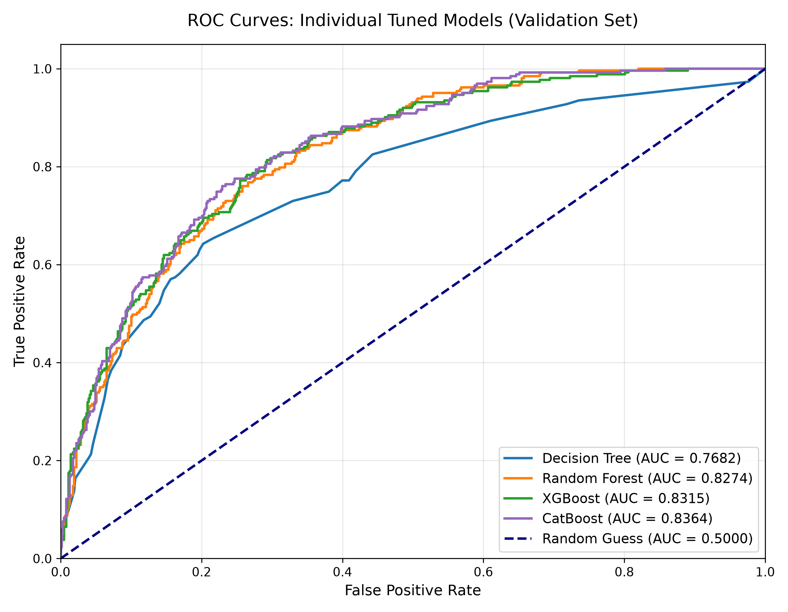
  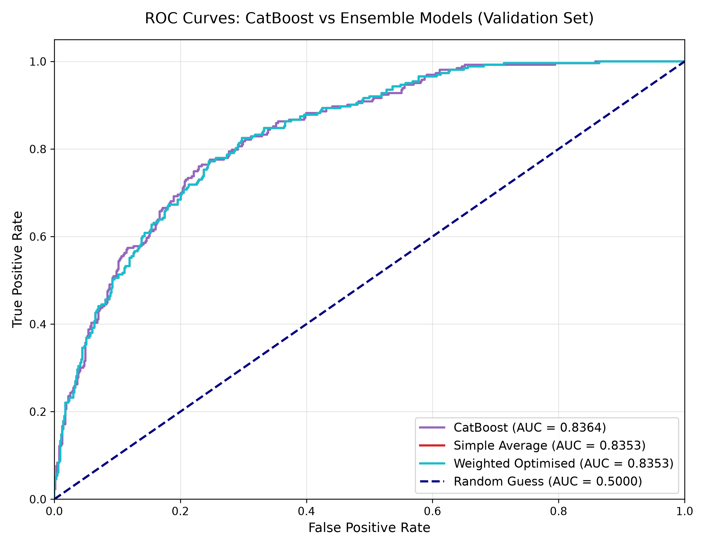

* **Individual Models:** **CatBoost** achieved the top validation score (**AUC = 0.8364**), outperforming **XGBoost** (**0.8315**), **Random Forest** (**0.8274**), and the single **Decision Tree** (**0.7682**).
* **CatBoost vs. Ensembles:** CatBoost slightly outperformed both the **Simple Average** and **Weighted Optimised** ensembles (**AUC = 0.8353**), maintaining superior discrimination across thresholds without added complexity.
=

#### 4.1.2 Gain and Lift Chart Analysis (CatBoost vs. Weighted Optimised)

  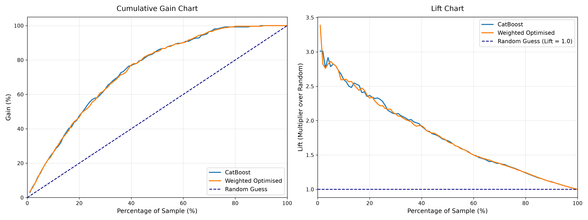

* **Gain & Lift Trajectory:** Both models show identical ranking performance, capturing **~60% of total defaults** in the top **30%** of high-risk applicants, with a **>2.7x Lift** in the top 10% decile.
* **Final Selection:** **CatBoost** is selected for deployment due to its superior AUC, faster inference speed, and lower operational complexity compared to multi-model ensembles.

### 4.2 Performance of CatBoost on Test Set

To confirm that the chosen **CatBoost** model generalizes effectively to unseen data, its final predictions were evaluated on the completely held-out test set.

#### 4.2.1 ROC Curve & Confusion Matrix Analysis

  
  

* **Generalization & ROC Performance:** The test set ROC curve (**AUC = 0.8355**) aligns almost perfectly with the validation curve (**AUC = 0.8364**). This minimal discrepancy confirms excellent model stability and absence of data leakage or test-set overfitting.
* **Classification Threshold Breakdown (Threshold = 0.5):**
  * **Overall Accuracy:** Achieves **78.11%** correct classifications across the test sample ($N = 891$).
  * **Specificity (Non-Default Retention):** Correctly identifies **565** non-defaulting loans (**89.40%** specificity), minimizing unnecessary credit rejections.
  * **Precision & Recall:** Captures **131** true defaults (**50.58%** recall) with a precision of **66.16%** (**131 / 198** flagged accounts).

#### 4.2.2 Cumulative Gain and Lift Chart Analysis

  

* **Cumulative Gain Efficiency:** Ranking test instances by predicted risk captures **~60% of all actual defaults** within the top **30%** of highest-risk flagged applications, significantly outperforming the random baseline.
* **Risk Targeting Lift:** In the top **10% decile**, the model provides a **~2.8x Lift** multiplier over random guessing (peaking above **3.4x** at the extreme risk tail), establishing strong commercial value for prioritized risk auditing and automated underwriting thresholds.

---

## 5. Feature Importance Analysis and Model Interpretability

### CatBoost Global Feature Importance

To understand the key drivers behind default risk predictions, global feature importances were extracted from the trained **CatBoost** model based on feature split contribution scores.

  

* **Primary Risk Drivers:** Financial capacity and credit history dominate model decisions. **`income`** and **`records`** emerge as the most influential features (~12.4 importance score each), closely followed by **`seniority`** (~11.3) and employment type **`job`** (~8.9).
* **Ratio & Collateral Signals:** Engineered features reflecting loan structure—such as **`ratio`** (price-to-amount ratio) and **`assets_amount_ratio`**—contribute significantly (~8.2 and ~5.7 respectively), confirming that collateral coverage relative to requested financing is a critical risk factor.
* **Secondary Demographic & Term Factors:** Traditional demographic variables like **`marital`** (~2.2), **`age_group`** (~3.0), and loan term **`time`** (~3.2) provide secondary refinement but carry substantially less weight compared to direct financial stability and credit history metrics.

---

## 6. Conclusion

### 6.1 Summary of Achievements

* **Model Superiority:** Evaluated four tree-based architectures and multiple ensemble strategies. **CatBoost** emerged as the winning model, achieving a top validation AUC of **0.8364** and maintaining strong generalization on the test set (**0.8355 AUC**).
* **Ensemble Parity:** Blending models via **Weighted Optimization** yielded equal weights ($\frac{1}{3}, \frac{1}{3}, \frac{1}{3}$) and identical performance (**0.8353 AUC**) to simple averaging, proving that standalone CatBoost provides optimal performance with less operational overhead.
* **Risk Discrimination:** In test evaluation, CatBoost demonstrated **$2.28\times$ precision lift** over random guessing at a $0.5$ threshold and captured **~60% of all defaults** within the highest-risk **30%** of applicants.

### 6.2 Key Takeaways & Impact

* **Core Risk Drivers:** Global feature importance revealed that financial stability (**`income`**, **`records`**, **`seniority`**) and loan-to-value collateral ratios (**`ratio`**, **`assets_amount_ratio`**) are the primary determinants of borrower default.
* **Business Value:** The model provides a reliable, automated risk-ranking mechanism that significantly reduces potential credit losses while keeping false rejection rates low (**10.6% false positive rate**).

### 6.3 Future Improvements

* **Threshold Optimization:** Shift from a static $0.5$ threshold to a cost-sensitive threshold tailored to the bank's specific financial trade-off between default costs and loan interest margins.
* **Advanced Feature Engineering:** Incorporate non-linear interaction terms and macro-economic metrics to further enhance model performance on subtle credit risk patterns.
* **SHAP Interpretability:** Implement local SHAP (SHapley Additive exPlanations) values to provide individual, explainable audit trails for rejected credit applications.

---

## 7. Acknowledgements

* **Dataset:** Based on the Credit Scoring dataset from [gastonstat/CreditScoring](https://github.com/gastonstat/CreditScoring).
* **Inspiration:** Core concepts inspired by the [DataTalksClub Machine Learning Zoomcamp](https://github.com/DataTalksClub/machine-learning-zoomcamp).

### Key Improvements & Technical Enhancements

This project goes significantly beyond the baseline course material through full end-to-end refactoring and technical expansion:

* **End-to-End Pipeline Architecture:** Refactored raw procedural code into clean, modular scripts for data cleaning, feature engineering, cross-validation, and automated model training.
* **Expanded Model Benchmarking:** Extended evaluation beyond basic decision trees to include tuned ensemble models (CatBoost, XGBoost, Random Forest) alongside **Simple Average** and **Scipy-Optimized Weighted** ensembling strategies.
* **Advanced Visualizations & Interpretation:** Developed publication-ready multi-panel plots for ROC, Cumulative Gain, and Lift curves across Train/Val/Test splits, supplemented by CatBoost feature importance rankings.
* **Refactored Model Evaluation:** Conducted rigorous multi-threshold confusion matrix analysis, isolating trade-offs between precision, recall, and specificity ($89.4\%$) to inform business decisions.
* **Interactive Web Deployment:** Packaged the optimized CatBoost pipeline into a user-friendly Web App for real-time interactive credit risk scoring and decision support.